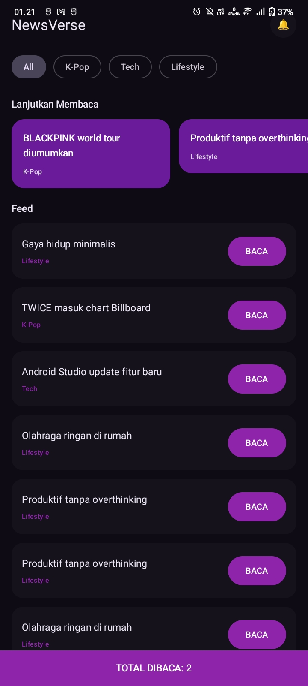
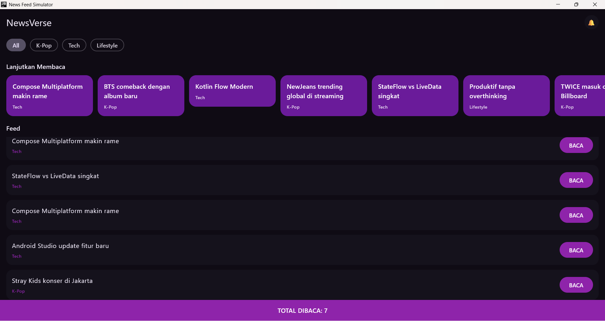
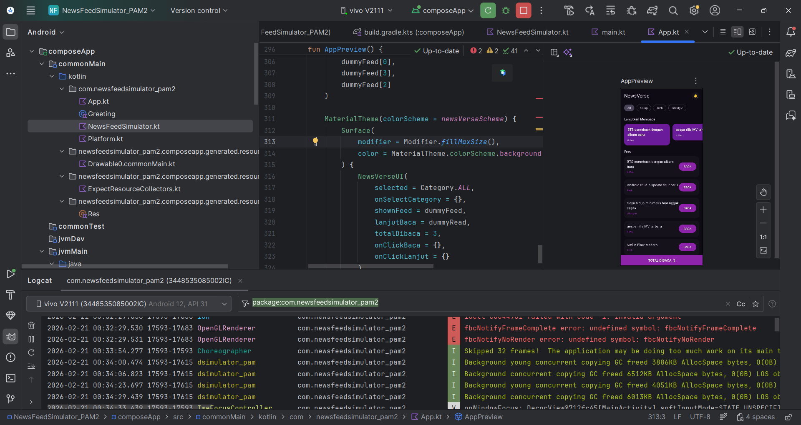

# PAM Tugas 2 – News Feed Simulator  

**Nama:** Silvia  
**NIM:** 123140133  
**Kelas:** Pengembangan Aplikasi Mobile RB  

Project ini merupakan aplikasi **News Feed Simulator** berbasis **Kotlin Multiplatform (KMP)** yang menargetkan:

- Android  
- Desktop (JVM)  

Aplikasi ini menampilkan berita secara dinamis menggunakan **Coroutine, StateFlow, dan Jetpack Compose Multiplatform**.

---

## ✨ Fitur Utama

- Filter kategori (All, K-Pop, Tech, Lifestyle)  
- Feed berita dinamis  
- Fitur **Lanjutkan Membaca** (horizontal list)  
- Detail berita dalam dialog  
- Counter **TOTAL DIBACA**  

---

## 📸 Screenshot Aplikasi

### 1️⃣ Tampilan Utama


### 2️⃣ Lanjutkan Membaca


### 3️⃣ Detail Berita


---

## 🛠 Teknologi yang Digunakan

- Kotlin Multiplatform  
- Jetpack Compose Multiplatform  
- Coroutine & StateFlow  
- Material 3  

---

## ▶ Cara Menjalankan

### Android
Jalankan melalui Android Studio dengan memilih device atau emulator.

Atau lewat terminal (Windows):

```bash
.\gradlew.bat :composeApp:assembleDebug
